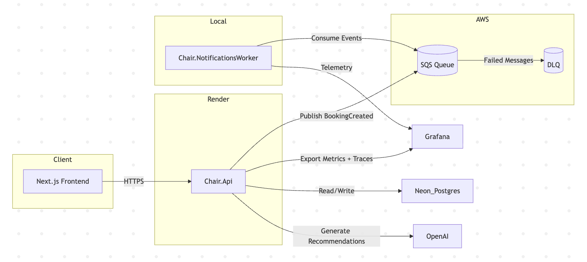
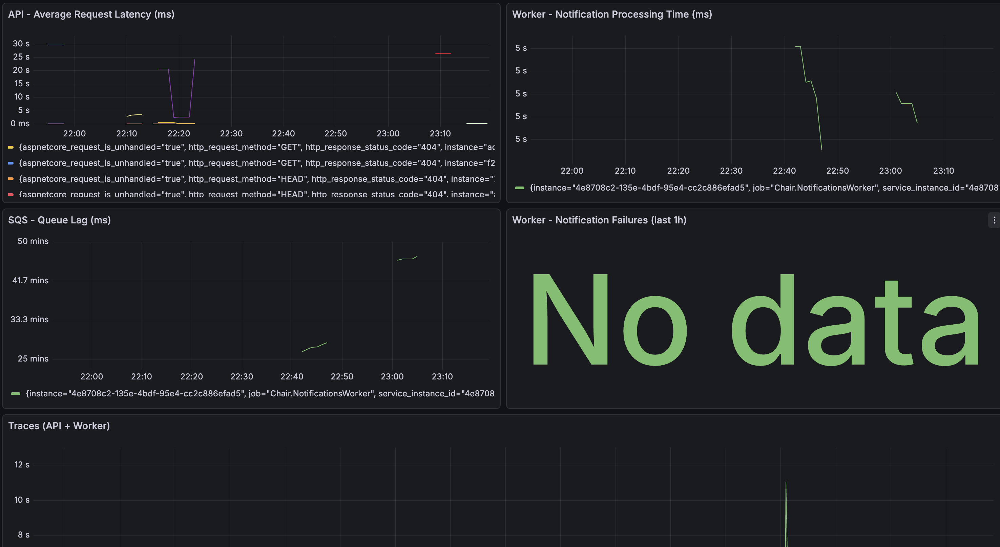

# Chair – Scalable Booking Platform

> **An event-driven booking system built with Next.js, .NET, AWS SQS, Terraform, and Grafana Cloud**  
> Designed to showcase distributed systems, observability, and infrastructure engineering in one cohesive project.

---

## Overview

Chair is a stylist discovery and booking platform demonstrating **real-world engineering principles**:
- Event-driven architecture (async booking pipeline via AWS SQS)
- Reliability patterns (DLQ, retries, idempotency)
- Observability (OpenTelemetry + Grafana Cloud)
- Infrastructure as Code (Terraform)
- CI/CD automation (GitHub Actions + Render)

---

## Architecture Snapshot

**Core Components**
| Component | Purpose |
|------------|----------|
| `Chair.Api` | ASP.NET Core API handling bookings and publishing SQS events |
| `Chair.NotificationsWorker` | Background service processing events and sending notifications |
| AWS SQS + DLQ | Decouples processing, adds resilience |
| Terraform | Automates provisioning of queues and roles |
| Grafana Cloud | Provides traces, metrics, and visual dashboards |
| Render + Vercel | Hosts backend and frontend respectively |

---

## Observability Highlights

- API & Worker traces stitched together with **W3C traceparent** headers
- Metrics: request latency, queue lag, failure count
- Grafana visualizes latency spikes, retries, DLQ growth

---

## Infra Automation

- Terraform provisions AWS resources with a **remote S3 state**.
- GitHub Actions pipeline automates:
    - Terraform plan & apply
    - API deployment to Render

---

## What I Learned

- Why **event-driven architecture** enables scalable and fault-tolerant design
- How to **instrument distributed tracing** across microservices
- The role of **retries & backoff** in making systems reliable
- The importance of **IaC** in making infrastructure reproducible, reviewable, and production-grade
- How to use **AI** to extend domain logic intelligently
- Techniques for **load testing** and validating system behavior under stress

Full deep dive in [docs/architecture.md](docs/architecture.md).

---

##  Tech Stack

**Backend:** .NET 8, EF Core, Serilog, OpenTelemetry  
**Infra:** AWS SQS, Terraform, GitHub Actions, Render  
**Frontend:** Next.js (Vercel)  
**Monitoring:** Grafana Cloud

---

## Future Enhancements

- Redis caching for stylist listings
- ECS Fargate deployment for worker scalability
- Automated DLQ reprocessing
- Real email notifications (SES or SendGrid)

---

## Documentation
- [System Architecture](docs/architecture.md)
- [Lessons Learned](docs/lessons-learned.md)
- [Load Test Result](docs/screenshots/loadtest.png)

---

## Author
Built by Olamide Abegunde
> Building modern systems at the intersection of distributed infrastructure, cloud reliability, and applied AI.